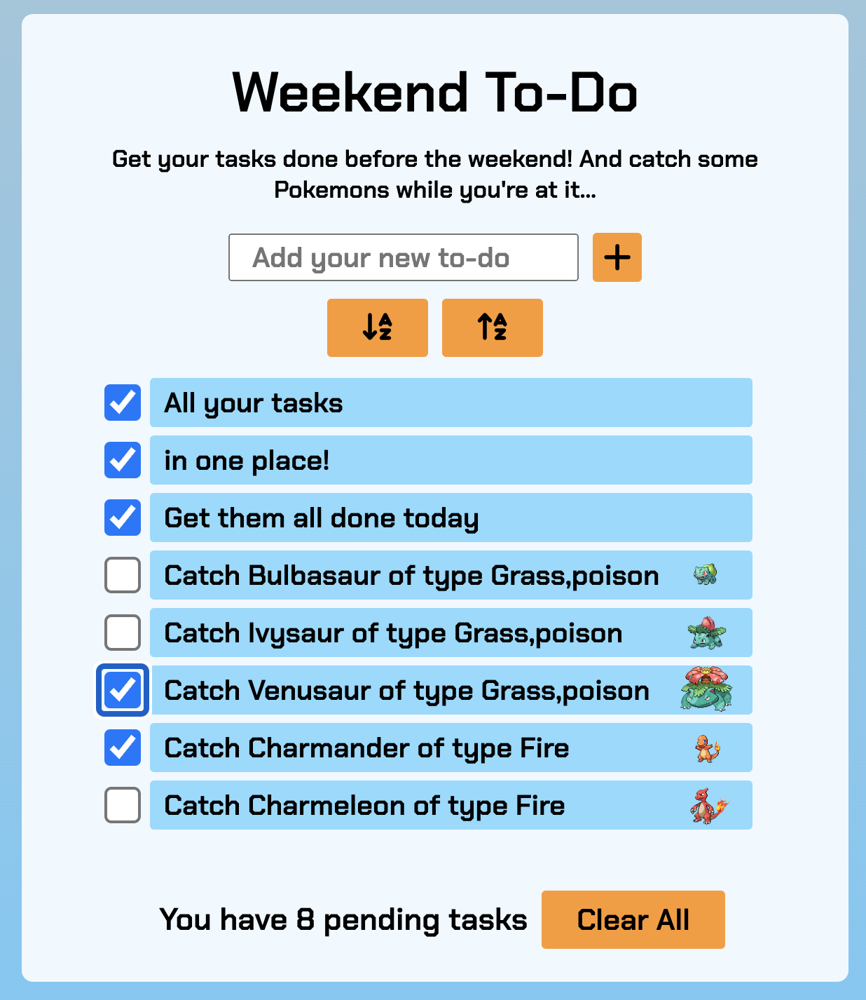

# Monday Exercises - Exercise 6 - React

This is my task for Exercise 6 of Monday-U Full Stack course. Task requirements are detailed below.

-  Please try the app (older version) right here: https://weekend-todo.netlify.app/

## Demo video:

## Task requirements:

### The requirements:

-  [x] Remove `app.use(express.static(path.join(__dirname, 'dist')))` from your `server.js` file
-  [x] Delete `src/server/dist` **ONLY** when your new client is up and running
-  [x] Initialize your React project in the `src` folder using [create-react-app](https://create-react-app.dev/docs/getting-started/) with the name `client`
-  [x] Decompose your Todo App into components (controlled and uncontrolled)
-  [x] Re-Implement the Todo App using hooks
-  [x] Use [**propTypes** & **defaultProps**](https://reactjs.org/docs/typechecking-with-proptypes.html) to add type-checking to your components

### Bonus

-  [x] Add error handling for communication issues with your backend (Empty state / Loader / Something else)- **Added errors around api requests and added a loader.**
-  [x] Use components from the [Vibe Design System](https://github.com/mondaycom/monday-ui-react-core) (monday.com's component library) - **Added the text field component.**
-  [x] Use [React Router](https://reactrouter.com/docs/en/v6) to add basic routing capabilities to your app
   -  [x] Add Tabs / Navigation bar to help route between pages [Tabs example](https://style.monday.com/?path=/docs/navigation-tabs-tab--overview)
   -  Page suggestions
      -  [ ] Task completion statistics page - # of open tasks, total number of tasks, average tim to finish a task, etc.
      -  [x] About page - with some fun facts and profile picture

## CLI(exc 3)

[Readme](./cli-ex3/README.md)
