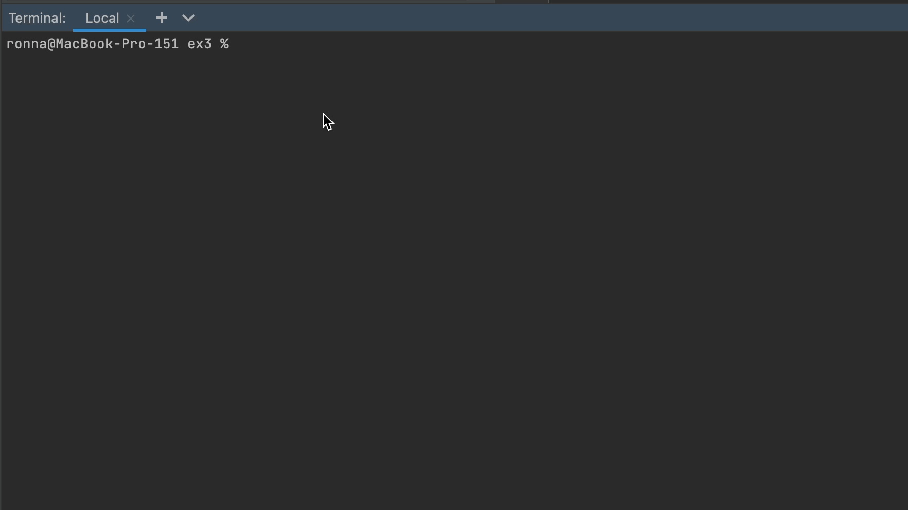

# Exercise 3 - Node.js, CLI

To run the program use `node inquirer.js` (with interactive menu) or `node commander.js`(without interactive menu)

You can also call it using `npx todo-console-app-assh` (calls inquirer.js).

-----

=======

## In this section you will practice

**Node.js** - Build your first node.js cli app   
**Npm** - Work with external libraries  
**Files** - Read and write from the file system  

## What you are going to build

We already have a beautiful todo app that will help us to catch all the pokemons.  
Now let's create cli tool, so we can add, delete, and view todos like a real pro 👩‍💻 🧑‍💻 

Use your code from the last exercise and refactor where needed.

### The requirements:

- [x] Build node.js cli todo app
- [x] Detailed help option // every command has a description
- [x] Read/Write/Delete todos from a file // + sort, + clear

When you finish it should look like this:

### Bonus

- [x] Publish your code as npm package and run it with npx
- [x] Add colors to your cli tool // every command has its color; new todos are green when shown for the first time
- [x] Add Inquirer.js and make your cli tool interactive
- [x] Display pokemon image (ascii art) // for ids from 1 to 151 (default picture for the rest)
