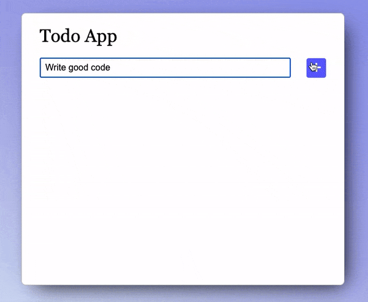

# Exercise 4 - Express.js

You know what they say about #4: you'll remember it *for*ever (ha)

## In this section you will practice

**Express** - One of the most popular server frameworks for node.js
**APIs** - We've already worked with an external API (the Pokemon one) - now we're going to build our own!
**CRUD** - Create, Read, Update, Delete - the four fundamental operations of any API. We aren't updating yet, but the principles are the same

## What you are going to build

So far our whole app has been 100% local, and if you refreshed the page - that's it, all your todos were gone. No persistency. So sad.

But that changes today! We're going to create a server that will handle all our todo items, _and_ our Pokemon fetching, and finally take our first step in becoming real #fullstack developers #hashtag

You can use your existing project (copy+paste then refactor), or use the boilerplate we've set up for you in this `ex4` directory

### The requirements:

- [ ] Create your express backend (include separate `dist` and `server` folders)
- [ ] Your `server.js` file should have all the express boilerplate and host your `dist` directory to any client that requests it (hint: you'll need to `.use` the `express.static` method)
- [ ] Create an `api.js` file that acts as the 'controller' of your backend, handling all the routes (endpoints)
- [ ] Create separate endpoints for (1) fetching all the todo items, (2) creating a new one, and (3) deleting an existing one (hint: don't forget `bodyParser`)
- [ ] Move the pokemon fetching code to the backend - use `axios` instead of `fetch` for your requests
- [ ] On app load (i.e. when a user enters the page) it should fetch all the todo items and render them

In terms of the front end, it will look the same as before:

But now when you refresh the page **the data should still be there**

### Bonus

- [ ] Create a [middleware](https://expressjs.com/en/guide/using-middleware.html) that makes a log each time a user accesses any of the routes (you can just do a `console.log`)
- [ ] Handle server errors elegantly. Specifically, if anything goes wrong the user should see an error message (ideally, not an alert) with an explanation of what went wrong instead of crashing the page
- [ ] Add a loder/spinner to the page that indicates the client is waiting for an async operation (e.g. a call to the server) to finish
- [ ] Add simple caching to your server. If a user requests for the same pokemon ID three times in the same minute, for example, it should only make a request to the Pokemon API once. You can use a simple in-memory data structure for your cache
