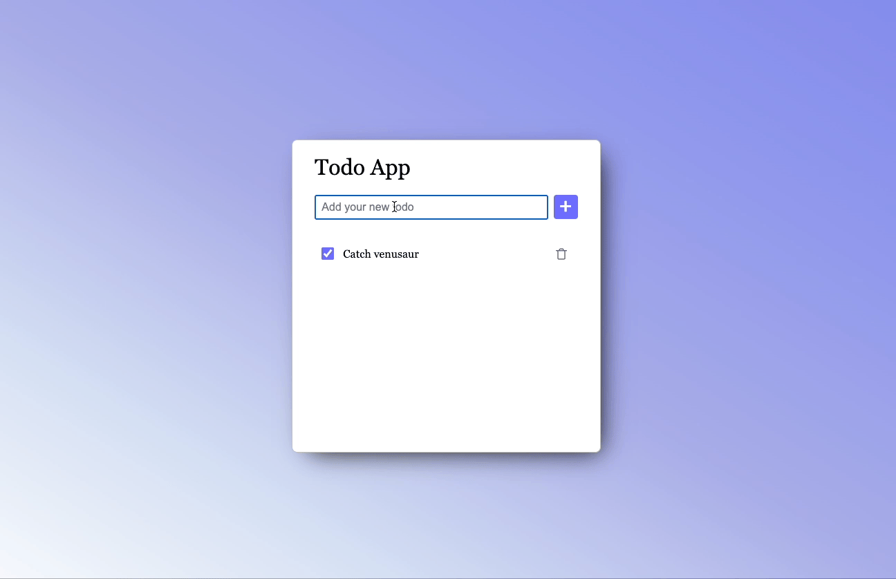

# Exercise 5 - Sequelize ORM

It is not persisted until you persist it!

## In this section you will practice

**Initializing Sequelize ORM** - Connect NodeJS application to your mysql DB using Sequelize ORM 

**Sequelize models** - Use Sequelize models to execute queries on your DB

**Migrations and seeds** - Manage DB changes using Sequelize migrations

## What you are going to build

In the last exercise, you've added an ExpressJS server to your todo app, which allowed you to reload your todos from server. 

But what happens when you restart your server?! you guessed right, all todos disappeared :( 

In this exercise we will add a DB to our application that will hold all items' data. This will provide us a real persistent storage that would keep our data even if our server is down. 

You can use your ex4 solution or use the boilerplate in this folder. 

### Prerequisites:
Following pre-requisites were covered in our last workshop. 
- Download and install [docker](https://docs.docker.com/get-docker/)
- Open console and pull latest mysql image: ```docker pull mysql/mysql-server ```
- Run mysql container and initialize it with the proper user, password, db name and permissions: ```docker run -p 3306:3306 --name tododb -e MYSQL_ROOT_PASSWORD=password -e MYSQL_ROOT_HOST=% -e MYSQL_DATABASE=todo_db -d mysql/mysql-server```
- Validate container is up: ```docker ps``` 

### The requirements:

- [ ] Install Sequelize and mysql driver. [Sequelize- Getting Started](https://sequelize.org/docs/v6/getting-started/)
- [ ] Install Sequelize CLI. [Installing the CLI](https://sequelize.org/docs/v6/other-topics/migrations/)
- [ ] Initialize Sequelize using `npx sequelize-cli init` inside 'src/server/db' folder 
- [ ] Create Items table using [Sequelize migration](https://sequelize.org/docs/v6/other-topics/migrations/#creating-the-first-model-and-migration) - a new table with id and ItemName fields
- [ ] Modify `item_manager.js`: remove items array and modify all item operations to use Item model
- [ ] Create and run a separate migration for adding a `status` column (BOOLEAN) to Items table in your DB
- [ ] Add checkbox to each item in UI to indicate its status (Done vs not)
- [ ] Modify client and server code to support persistence of the new Item status 

Your todo app should have now an additional checkbox that marks the status of the item. Every change to the checkbox should be stored in our Items table under the status column (true or false)

Now, even if your server is down - all your items are stored. Once the server is up again - you should be able to see all items.

Here is an example how it can look on the client side:


### Bonus

- [ ] Add "Done" timestamp
- [ ] Add index to the Items table (which columns compose the index?) 
- [ ] Add server validation - create a new item only if not exists (Use transaction)
- [ ] Add edit capabilities to an item. 
